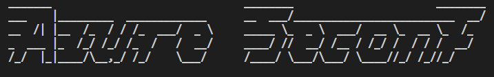

# Azure Seconf



This tool will benchmark your Azure Subsrciption against CIS. It displays which are rules that your Azure subscription is COMPLIANT and which are NON-COMPLIANT.

## Credentials file
This the file where your Azure credential file should be stored. It should be stored in JSON format.

Change the `creds.json.example` to `creds.json`

Now enter the credentials in the corresponding field.

```
{
    "CREDENTIALS" : {
        "SUBSCRIPTION_ID" : "Enter your subscription id here",
        "TENANT_ID" : "Enter your tenant id here",
        "CLIENT_ID" : "Enter your client id here",
        "CLIENT_SECRECT" : "Enter your client secrect here"
    }
}
```
> NOTE: This is an important step if you don't perform it correctly the script won't work. 

`If credentials is not entered properly then authentication error will be displayed.`

## Requirements
This script requires additional dependencies that needed to be downloaded.

To install requirements run this following command

> `pip3 install -r requirements.txt`

## To run

In order to run this script go to following directory that you downloded.

Now run the following command
> user@machine: ~/azure_seconf$ python3 azure_cis.py [optional arguments]

## Usage
```
usage: Azure SeConf [-h] (-c | -r | -v VERSION)

Azure CIS benchmark tool for compliance and remediation

optional arguments:
  -h, --help            show this help message and exit
  -c, --check_compliance
                        To check whether your Azure subscription is compliant to CIS Benchmark
  -r, --remediation     To remediate the Azure Resource Configs as per CIS Benchmark
  -v VERSION, --version VERSION
                        To display the version of the tool
```